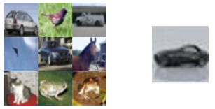
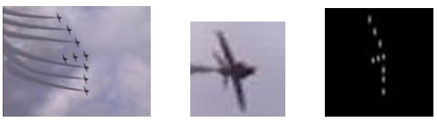
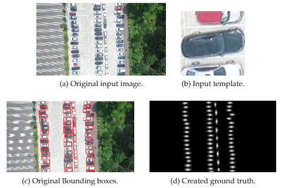
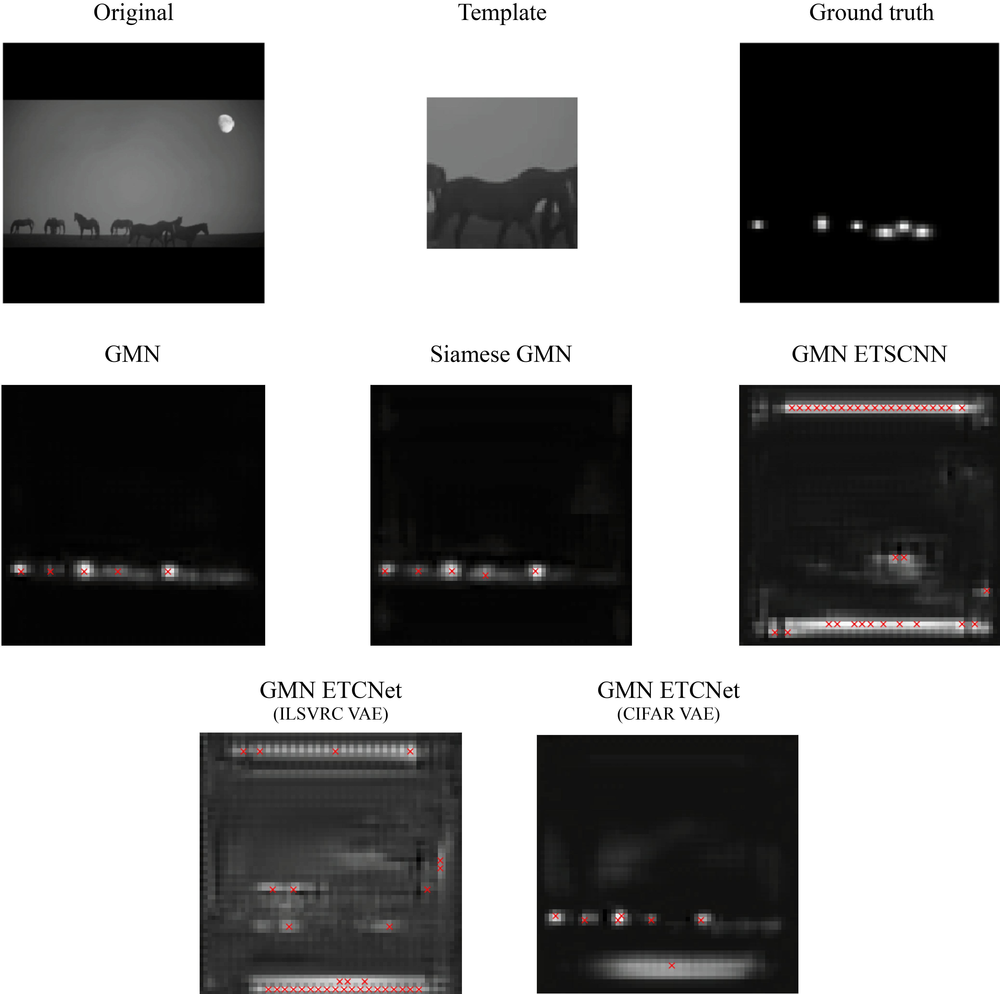

# Study of Deep Learning Models for Class-Agnostic Counting

## Abstract
In the field of object counting using computer vision techniques, multiple research projects developed highly performant models for counting specific classes. Nonetheless, none has achieved a deep learning model able to count any object independently of the class and very few have worked in that direction. We believe that achieving this class-agnostic counting model is possible by using deep learning methodologies such as Convolutional Neural Networks.

We have developed a set of Convolutional neural networks following different counting strategies to validate our hypothesis and achieve a class-agnostic counting model, as well as with the purpose of proposing the best strategy to achieve a model with these characteristics. The developed models, try several ways of approaching the counting task using common CNN architectures that work well in other environments and by analyzing the counting task from a human point of view while trying to mimic our image processing behavior. Furthermore, three datasets have been defined following different counting approaches for training and evaluating the developed models, even in unseen data to evaluate their generalization capabilities without requiring to be trained on it.

This master thesis proposes what we believe is the best approach for achieving class-agnostic counting as well as a new model improving the current state of the art in class-agnostic counting. We believe that the best approach is by developing a regression-based model with a spatial density output which splits the several tasks that take part in the counting problem into smaller and, if possible, supervised modules specialized in each sub-task. Moreover, this project offers a set of datasets that can be used in future works, fomenting this way the further research of a true class-agnostic counting model which doesn't require to be trained in unseen instances.

## Datasets

The datasets developed in this project are:
 - Count CIFAR10: A simple dataset for direct counting where the input is an image grid formed with samples from the CIFAR10 dataset and a template as reference of the object to be counted.
 
 

 
 - ILSVRC2015: A transformation of the dataset from the ImageNet challenge to fit a spatial density counting task.

 

 
 - CARPK: A transformation of the CARPK dataset to fit a spatial density counting task.
 
 

 
 ## Spatial density results

Spatial density results for each tested model where the white areas represent the regions where the features of the template were detected, and the red crosses are the local maximum counts.

